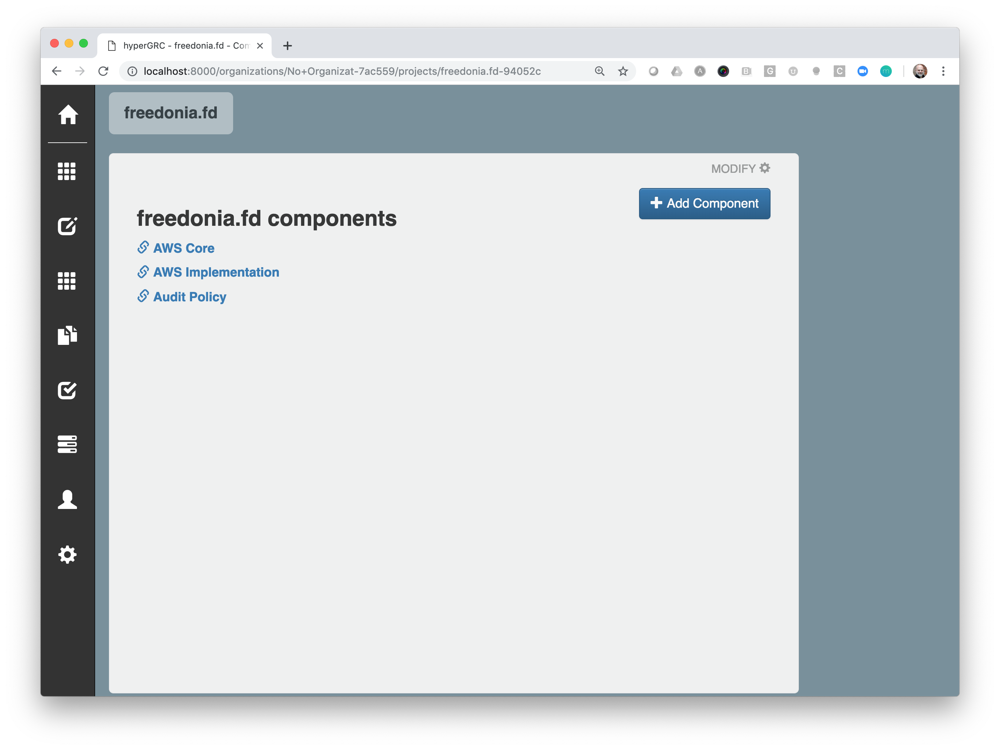
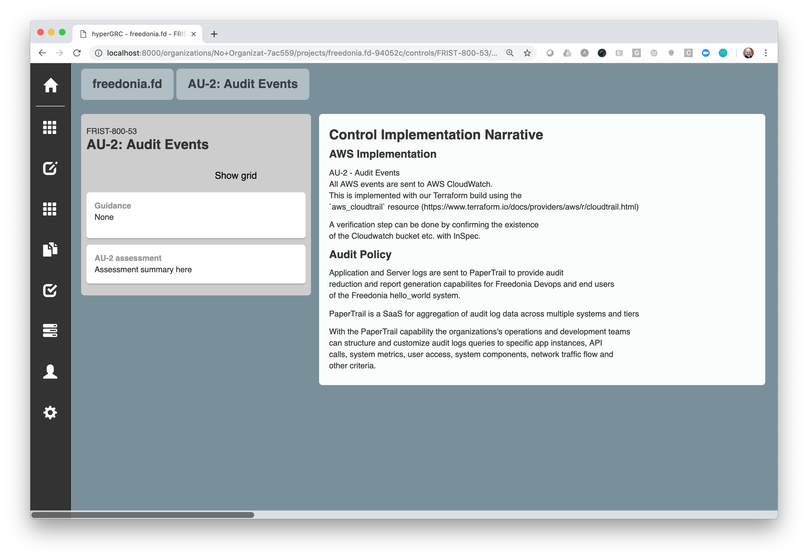

Beginner Exercise for OpenControl: Welcome to Freedonia Compliance
===================================================================

_Updated and tested in February 2019!_

This project repository demonstrates a simple `System Security Plan` generated using the [OpenControl](http://open-control.org/) framework to automate security compliance paperwork.

Audience
---------

Anyone trying to get started with [OpenControl](http://open-control.org/), [Compliance-Masonry](https://github.com/opencontrol/compliance-masonry), and [hyperGRC](https://github.com/GovReady/hyperGRC):

* FISMA newbies that don't want to write big word documents
* FISMA experts that need a more efficent way of doing paper work
* FISMA enforcers that need to trust the OpenControl model and tools we're presenting

Scenario
--------

Freedonia modeled their `FRedRAMP` program for cyber security certification of major Information Systems after America's `FedRAMP` program for certifying cloud service providers.

The starting point for `FRedRAMP` certifications is the `FRIST 800-53`, which is like America's `NIST 800-53` except with fewer security controls.

### The Controls

Freedonia's `FRIST 800-53` has only 6 security controls:

| ID         | Title          | Type |
| ---------- | -------------- | --------|
| AU-1 | AUDIT AND ACCOUNTABILITY POLICY AND PROCEDURES | organizational control on audit policy |
| AU-2 | AUDIT EVENTS | technical control at the node level |
| PE-2 | PHYSICAL ACCESS AUTHORIZATIONS | organization control on who accesses data center |
| SC-1 | SYSTEM AND COMMUNICATIONS PROTECTION POLICY AND PROCEDURES | organizational control on how components communicate securely |
| SC-7 | BOUNDARY PROTECTION | technical control defending boundary of entire system |
| XX-1 | MOCK/DUMMY CONTROL | here to demonstrate that a control in standard does not have to referenced in a certification |

### The Certification

The certification of `FRedRAMP-Low` requires all the above controls except for XX-1.

The standards and certifications are included in this repository, but also housed in a separate repository for easier re-use at [https://github.com/opencontrol/freedonia-frist](https://github.com/opencontrol/freedonia-frist).

### The Information System

The system we're building is a 'Hello World' website for Freedonia, which will comprise:

* Two Amazon Web Service Virtual Private Clouds (AWS VPCs),
one each for development and production
* In each AWS VPC, one node with `NGINX` web server and the static content for the website
* Infrastructure for logging traffic

\[Note: This system is still fictitious, but could be built if it helps Masonry users understand the process\]

Requirements to Use OpenControl
--------------------------------
These steps assume you already have:

* a \*nix type operating system
* [Compliance Masonry installed](https://github.com/opencontrol/compliance-masonry#installation)
* `calibre` installed for PDF generation
    * For OS X with Homebrew installed, try `brew cask install calibre`
* `node-js` installed for local viewing at https://localhost:4000


Minimal File Structure for an OpenControl-based SSP
----------------------------------------------------

Here's the tree structure of our repository:

```
.
├── README.md   # the file you're reading now
├── components
│   ├── AU_policy
│   │   └── component.yaml        # a local description of the Audit policy (AU)
│   ├── AWS_core
│   │   └── component.yaml        # a local description of the "AWS core" component
│   └── AWS_implementation
│       └── component.yaml        # a local description of the "AWS implementation" component
│
├── markdowns         
│   ├── README.md             # the introduction to the entire SSP
│   ├── SUMMARY.md            # a table of contents for narrative documents of the SSP
│   └── docs  # directory for narrative documents
│       ├── about-the-ssp.md
│       └── Waterfall_model.png # an example image
├── opencontrol.yaml          # the schema for SSP and its remote resources/dependencies
```

Running `compliance-masonry` will also generate the directories `opencontrols` and `exports`

It just so happens you can get these files and file tree structure by cloning this repository!

#### The opencontrol.yaml Config File

Notice one file in particular, the `opencontrol.yaml` file in the root directory of the tree. The `opencontrol.yaml` file is key to using OpenControl.

OpenControl uses a config file called `opencontrol.yaml` following the popular configuration file pattern we see with so many tools today. Every OpenControl repository will have at least one `opencontrol.yaml` file providing critical information and, importantly, information about dependencies on other other OpenControl YAML files and repos.

Here's what the `opencontrol.yaml` file for our Freedonia project looks like:

```yaml
schema_version: "1.0.0"
name: freedonia.fd
metadata:
  description: Simple example of OpenControl Compliance-as-Code
  maintainers:
    - greg.elin@govready.com
components:
  - ./components/AU_policy
  - ./components/AWS_core
  - ./components/AWS_implementation
standards:
  - ./standards/FRIST-800-53.yaml
certifications:
  - ./certifications/FredRAMP-low.yaml
```

Using Compliance-Masonry Quickstart to Build your SSP from Structured Data
--------------------------------------------------------------------------

Clone this repo, then `cd` into `freedonia-compliance`.  Then run:

```shell
compliance-masonry get
compliance-masonry docs gitbook FredRAMP-low
```

The `compliance-masonry get` command reads the `opencontrol.yaml` file and retrieves all the dependencies, even from other OpenControl repositories!

The `compliance-masonry docs gitbook FredRAMP-low` command generates a document of the components and standards matching the `FRedRAMP-Low` certification that is expressed in the `gitbook` format.

At this point, you have generated content for your `SSP` inside of the `exports` directory that has artfully combined data from the all other OpenControl `YAML` files into a `gitbook`!

Our next step is to publish/deploy our `gitbook` content representing our SSP for shared human access. First, install [GitBook](https://github.com/GitbookIO/gitbook-cli#readme):

```shell
npm install -g gitbook-cli
```

To make a PDF version:

```shell
cd exports && gitbook pdf ./ ./compliance.pdf
# creates the PDF at `exports/compliance.pdf`
```

> 

A complete generated PDF is [included here](./assets/example.pdf).

To make a HTML web site version:

```shell
cd exports && gitbook serve
# visit your HTML SSP at http://localhost:4000
```

> 

and like this on a page for particular control:

> 

The steps above are included in the project's `Makefile` so you can reliably run, say:

```shell
make clean pdf
# or
make clean serve
```

hyperGRC Quickstart to Maintain your SSP Control Content in a GUI with Structured Data
---------------------------------------------------------------------------------------

Clone this repo and clone [hyperGRC](https://github.com/GovReady/hyperGRC).

Then `cd` into `hyperGRC` repository and follow the `README.md` instructions to install the Python packages.

To view Freedonia-Compliance in hyperGRC:

```shell
python -m hypergrc ../freedonia-compliance/
```
_NOTE: Python 3.5 or higher required. Also, your path to freedonia-compliance repo may be different._

Visit your OpenControl repo in a GUI at `http://localhost:8000`

See a list of components:

> 

View controls associated with a component:

> 

View control assembled from components:

> 

Review
-------

We've generated a very simple `System Security Plan` from a bunch of re-usable `YAML` files and Markdown content in a computer-controlled pipeline style instead of a manually created word documents.

There are big benefits to this approach:

1. Our `SSP` is now managed like our codebase; anytime we update our code we can also update our `SSP` and publish a new one with a single click
2. Our `SSP` is more structured and more machine-readable, so we can do other processing
3. We can document compliance of re-usable components ONCE and re-use the documentation, too

Next Steps
----------

OK. So we got a document. But how do we do include actual verification of the controls in the document? We've started another repo (still in progress) to show building a system and documentation together--and deploying both. Visit [freedonia-aws-compliance](https://github.com/opencontrol/freedonia-aws-compliance) for that.

You could use this repo as a kind of stub file for your own compliance documentation. Just change the `opencontrol.yaml` file and the content in the repo.


Feedback
--------

Please [open an issue](https://github.com/opencontrol/freedonia-compliance/issues) as needed.
